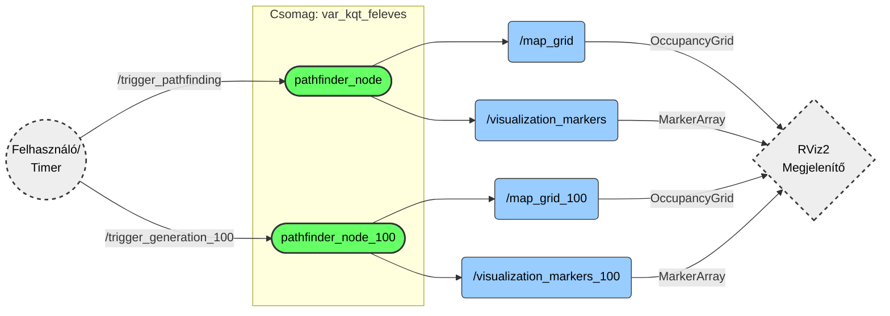

[HU](#magyar) [EN](#english)
# Magyar
# Útvonaltervező (var_kqt_feleves)

Ez a ROS 2 csomag (package) automatizált labirintus-generálást és különböző útvonalkereső algoritmusok vizualizációját valósítja meg. A rendszer moduláris felépítésű, lehetővé téve mind a kisméretű (15x15) oktatási célú demonstrációt, mind a nagyméretű (100x100) teljesítménytesztelést.

A szoftver teljes mértékben kompatibilis a **ROS 2 Humble Hawksbill** és **ROS 2 Jazzy Jalisco** rendszerekkel.

## Tartalomjegyzék
1. [Funkciók](#funkciók)
2. [Rendszerkövetelmények](#rendszerkövetelmények)
3. [Telepítés](#telepítés)
4. [Használat](#használat)
    - [Útvonaltervező Mód](#1-útvonaltervező-mód)
    - [Nagy méretű map generálása](#2-nagy-méretű-map-generálása)
5. [Konfiguráció és Paraméterek](#konfiguráció-és-paraméterek)
6. [Manuális Vezérlés](#manuális-vezérlés)
7. [Technikai Részletek](#technikai-részletek)

## Funkciók

## Képernyőképek
Ez jelenleg placeholder, 15x15 útvonallal kerül ide
<p align="center">
  
</p>

* **Iteratív Labirintus Generálás:** Recursive Backtracker algoritmus stack-alapú implementációja, amely garantálja a tökéletes (körmentes) labirintust.
* **A*** **(A-csillag) Keresés:** Heurisztikus útvonaltervezés a leggyorsabb eljutás érdekében.
* **DFS (Depth-First Search) Keresés:** Az összes lehetséges útvonal felkutatása (csak kis térképeken aktív).
* **Valós idejű Vizualizáció:** Integráció az RViz2-vel (OccupancyGrid térképek, útvonalak és jelölők megjelenítése).
* **Skálázhatóság:** Külön node dedikálva a nagy méretű (100x100-as) térképek generálására.

## Rendszerkövetelmények
* **ROS 2 Disztribúció:** Humble vagy Jazzy (Desktop telepítés ajánlott az RViz miatt)
* **Fordító:** C++17 kompatibilis fordító (g++)
* **Build rendszer:** colcon

## Telepítés

Kövesse az alábbi lépéseket a csomag forráskódból történő építéséhez:

1. **Workspace-be lépés:**
   ```bash
   cd ~/ros2_ws/src
   ```
2. **Repository klónozása:** (Szükség esetén URL sajátra cserélése)
   ```bash
   git clone git@github.com:dzoli15/var_kqt_feleves.git
   ```
3. **Fordítás:**
   ```bash
   colcon build --packages-select var_kqt_feleves
   ```
4. **Környezet betöltése/source-olás:**
    ```bash
   source install/setup.bash
   ```

## Használat
A csomag két fő futtatási móddal rendelkezik, amelyekhez előre konfigurált launch fájlok tartoznak. Ezek elindítják a számítási node-ot és a vizualizációt (RViz2) is.

### 1. Útvonaltervező mód
Ez a mód egy 15x15-ös labirintust generál, kijelöl egy Start és Cél pontot, majd megkeresi a legrövidebb utat.
- Jellemzők: A* keresés, Összes út keresés (DFS), Részletes vizualizáció (piros vonal)
- Indítás:
```bash
ros2 laucnh var_kqt_feleves pathfinder_basic.launch.py
```

### 2. Nagy méretű map generálása
Ez a mód nagy méretű labirintusok gyors generálására szolgál. Ebben a módban az útvonalkeresés le van tiltva a számítási kapacitás megőrzése érdekében.
- Jellemzők: 100x100-as méret, OccupancyGrid vizualizáció. (Idővel legrövidebb útvonaltervezés.)
- Indítás:
```bash
ros2 laucnh var_kqt_feleves map_100.launch.py
```

## Konfiguráció és Paraméterek
A node-ok működése paraméterekkel testreszabható indításkor vagy a launch fájlok szerkesztésével.
| Paraméter	| Típus	| Alapérték	| Leírás |
| :---: | :---: | :---: | :--- |
| map_size	| int	| 15 / 100	| A labirintus oldalhossza cellákban. (Lásd: Technikai Részletek) |
| automatic_mode	| bool	| true	| **true:** Időzítővel folyamatosan újragenerál. |
|  |  |  | **false:** Várakozik a service hívásra. |
Példa paraméter felülbírálása indításkor:
```bash
ros2 run var_kqt_feleves pathfinder_node_100 --ros-args -p map_size:=50 -p automatic_mode:=false
```

## Manuális Vezérlés
Amennyiben az `automatic_mode` paramétert `false`-ra állítja, a generálás nem indul el magától. Ilyenkor ROS 2 Service hívásokkal vezérelheti a folyamatot.
1. Kis tervező (PathfinderNode) indítása:
```bash
ros2 service call /trigger_pathfinding std_srvs/srv/Trigger {}
```
2. Nagy tervező (PathfinderNode100) indítása:
```bash
ros2 service call /trigger_generation_100 std_srvs/srv/Trigger {}
```

## Technikai Részletek

### Méretkorrekció (páros v. páratlan)
A Recursive Backtracker algoritmus rács-alapú működése (Fal-Út-Fal struktúra) matematikai okokból páratlan méretű rácsot igényel a zárt keretek biztosításához.
-Ha a felhasználó **páros** számot ad meg (pl. 100), a rendszer automatikusan **+1-gyel megnöveli** a méretet (101-re).
-Ez nem hiba, hanem a generáló algoritmus stabilitását biztosító funkció.

### Algoritmusok szétváasztása
A 100x100-as módban a rekurzív útvonalkereső (DFS) algoritmusok le vannak tiltva. Ennek oka, hogy ekkora méretnél a lehetséges útvonalak száma exponenciálisan nő, ami rekurzív hívás esetén verem túlcsordulást (Stack Overflow) és a program összeomlását okozná. A `PathfinderNode100` ezért kizárólag generálásra és térkép-publikálásra optimalizált.




### Topicok
- `/map_grid` (nav_msgs/OccupancyGrid): A labirintus bináris térképe (0: út, 100: fal).
- `/visualization_markers` (visualization_msgs/MarkerArray): Útvonalak, Start/Cél kockák.
- A 100-as node esetén a témák neve `_100` utótagot kap (pl. `/map_grid_100`).

# English
