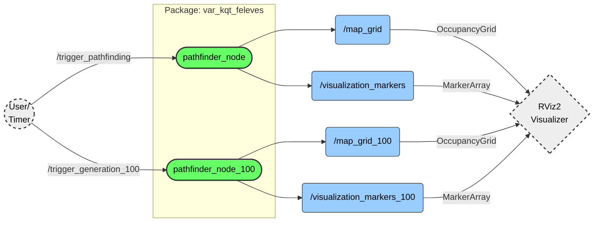

[HU](#magyar) [EN](#english)

# Magyar
# Útvonaltervező (var_kqt_feleves)

Ez a ROS 2 csomag (package) automatizált labirintus-generálást és különböző útvonalkereső algoritmusok vizualizációját valósítja meg. A rendszer moduláris felépítésű, lehetővé téve mind a kisméretű (15x15) oktatási célú demonstrációt, mind a nagyméretű (100x100) teljesítménytesztelést.

A szoftver teljes mértékben kompatibilis a **ROS 2 Humble Hawksbill** és **ROS 2 Jazzy Jalisco** rendszerekkel.

## Tartalomjegyzék
1. [Funkciók](#funkciók)
2. [Rendszerkövetelmények](#rendszerkövetelmények)
3. [Telepítés](#telepítés)
4. [Használat](#használat)
    - [Útvonaltervező Mód](#1-útvonaltervező-mód)
    - [Nagy méretű map generálása](#2-nagy-méretű-map-generálása)
5. [Konfiguráció és Paraméterek](#konfiguráció-és-paraméterek)
6. [Manuális Vezérlés](#manuális-vezérlés)
7. [Technikai Részletek](#technikai-részletek)

## Funkciók

### Képernyőképek
Ez jelenleg placeholder, 15x15 útvonallal kerül ide
<p align="center">
  
</p>

* **Iteratív Labirintus Generálás:** Recursive Backtracker algoritmus stack-alapú implementációja, amely garantálja a tökéletes (körmentes) labirintust.
* **A*** **(A-csillag) Keresés:** Heurisztikus útvonaltervezés a leggyorsabb eljutás érdekében.
* **DFS (Depth-First Search) Keresés:** Az összes lehetséges útvonal felkutatása (csak kis térképeken aktív).
* **Valós idejű Vizualizáció:** Integráció az RViz2-vel (OccupancyGrid térképek, útvonalak és jelölők megjelenítése).
* **Skálázhatóság:** Külön node dedikálva a nagy méretű (100x100-as) térképek generálására.

## Rendszerkövetelmények
* **ROS 2 Disztribúció:** Humble vagy Jazzy (Desktop telepítés ajánlott az RViz miatt)
* **Fordító:** C++17 kompatibilis fordító (g++)
* **Build rendszer:** colcon

## Telepítés

Kövesse az alábbi lépéseket a csomag forráskódból történő építéséhez:

1. **Workspace-be lépés:**
   ```bash
   cd ~/ros2_ws/src
   ```
2. **Repository klónozása:** (Szükség esetén URL sajátra cserélése)
   ```bash
   git clone git@github.com:dzoli15/var_kqt_feleves.git
   ```
3. **Fordítás:**
   ```bash
   colcon build --packages-select var_kqt_feleves
   ```
4. **Környezet betöltése/source-olás:**
    ```bash
   source install/setup.bash
   ```

## Használat
A csomag két fő futtatási móddal rendelkezik, amelyekhez előre konfigurált launch fájlok tartoznak. Ezek elindítják a számítási node-ot és a vizualizációt (RViz2) is.

### 1. Útvonaltervező mód
Ez a mód egy 15x15-ös labirintust generál, kijelöl egy Start és Cél pontot, majd megkeresi a legrövidebb utat.
- Jellemzők: A* keresés, Összes út keresés (DFS), Részletes vizualizáció (piros vonal)
- Indítás:
```bash
ros2 launch var_kqt_feleves pathfinder_basic.launch.py
```

### 2. Nagy méretű map generálása
Ez a mód nagy méretű labirintusok gyors generálására szolgál. Ebben a módban az útvonalkeresés le van tiltva a számítási kapacitás megőrzése érdekében.
- Jellemzők: 100x100-as méret, OccupancyGrid vizualizáció. (Idővel legrövidebb útvonaltervezés.)
- Indítás:
```bash
ros2 launch var_kqt_feleves map_100.launch.py
```

## Konfiguráció és Paraméterek
A node-ok működése paraméterekkel testreszabható indításkor vagy a launch fájlok szerkesztésével.
| Paraméter | Típus | Alapérték | Leírás |
| :---: | :---: | :---: | :--- |
| map_size | int | 15 / 100 | A labirintus oldalhossza cellákban. (Lásd: Technikai Részletek) |
| automatic_mode | bool | true | **true:** Időzítővel folyamatosan újragenerál. |
|  |  |  | **false:** Várakozik a service hívásra. |

Példa paraméter felülbírálása indításkor:
```bash
ros2 run var_kqt_feleves pathfinder_node_100 --ros-args -p map_size:=50 -p automatic_mode:=false
```

## Manuális Vezérlés
Amennyiben az `automatic_mode` paramétert `false`-ra állítja, a generálás nem indul el magától. Ilyenkor ROS 2 Service hívásokkal vezérelheti a folyamatot.
1. Kis tervező (PathfinderNode) indítása:
```bash
ros2 service call /trigger_pathfinding std_srvs/srv/Trigger {}
```
2. Nagy tervező (PathfinderNode100) indítása:
```bash
ros2 service call /trigger_generation_100 std_srvs/srv/Trigger {}
```

## Technikai Részletek

### Méretkorrekció (páros v. páratlan)
A Recursive Backtracker algoritmus rács-alapú működése (Fal-Út-Fal struktúra) matematikai okokból páratlan méretű rácsot igényel a zárt keretek biztosításához.
- Ha a felhasználó **páros** számot ad meg (pl. 100), a rendszer automatikusan **+1-gyel megnöveli** a méretet (101-re).
- Ez nem hiba, hanem a generáló algoritmus stabilitását biztosító funkció.

### Algoritmusok szétválasztása
A 100x100-as módban a rekurzív útvonalkereső (DFS) algoritmusok le vannak tiltva. Ennek oka, hogy ekkora méretnél a lehetséges útvonalak száma exponenciálisan nő, ami rekurzív hívás esetén verem túlcsordulást (Stack Overflow) és a program összeomlását okozná. A `PathfinderNode100` ezért kizárólag generálásra és térkép-publikálásra optimalizált.

### Topicok
- `/map_grid` (nav_msgs/OccupancyGrid): A labirintus bináris térképe (0: út, 100: fal).
- `/visualization_markers` (visualization_msgs/MarkerArray): Útvonalak, Start/Cél kockák.
- A 100-as node esetén a témák neve `_100` utótagot kap (pl. `/map_grid_100`).


---

# English
# Pathfinder (var_kqt_feleves)

This ROS 2 package implements automated maze generation and visualization of various pathfinding algorithms. The system is modular, allowing for both small-scale (15x15) educational demonstrations and large-scale (100x100) performance testing.

The software is fully compatible with **ROS 2 Humble Hawksbill** and **ROS 2 Jazzy Jalisco** systems.

## Table of Contents
1. [Features](#features)
2. [System Requirements](#system-requirements)
3. [Installation](#installation)
4. [Usage](#usage)
    - [Pathfinder Mode](#1-pathfinder-mode)
    - [Large Map Generation](#2-large-map-generation)
5. [Configuration and Parameters](#configuration-and-parameters)
6. [Manual Control](#manual-control)
7. [Technical Details](#technical-details)

## Features

### Screenshots
This is currently a placeholder; a 15x15 path will be placed here.
<p align="center">
  
</p>

* **Iterative Maze Generation:** Stack-based implementation of the Recursive Backtracker algorithm, guaranteeing a perfect (loop-free) maze.
* **A* (A-Star) Search:** Heuristic pathfinding for the fastest route.
* **DFS (Depth-First Search) Search:** Exploring all possible paths (active only on small maps).
* **Real-time Visualization:** Integration with RViz2 (displaying OccupancyGrid maps, paths, and markers).
* **Scalability:** A dedicated node for generating large-scale (100x100) maps.

## System Requirements
* **ROS 2 Distribution:** Humble or Jazzy (Desktop installation recommended for RViz).
* **Compiler:** C++17 compatible compiler (g++).
* **Build System:** colcon.

## Installation

Follow the steps below to build the package from source:

1. **Enter Workspace:**
   ```bash
   cd ~/ros2_ws/src
   ```
2. **Clone Repository:** (Replace URL with your own if necessary)
   ```bash
   git clone git@github.com:dzoli15/var_kqt_feleves.git
   ```
3. **Build:**
   ```bash
   colcon build --packages-select var_kqt_feleves
   ```
4. **Load Environment/Source:**
    ```bash
    source install/setup.bash
   ```

## Usage
The package has two main execution modes, which come with pre-configured launch files. These start both the computation node and the visualization (RViz2).

### 1. Pathfinder Mode
This mode generates a 15x15 maze, selects a Start and Goal point, and then finds the shortest path.
- Features: A* search, All paths search (DFS), Detailed visualization (red line).
- Launch:
```bash
ros2 launch var_kqt_feleves pathfinder_basic.launch.py
```

### 2. Large Map Generation
This mode is designed for the rapid generation of large-scale mazes. Pathfinding is disabled in this mode to conserve computational capacity.
- Features: 100x100 size, OccupancyGrid visualization. (Shortest pathfinding to be added in time.)
- Launch:
```bash
ros2 launch var_kqt_feleves map_100.launch.py
```

## Configuration and Parameters
The operation of the nodes can be customized via parameters at startup or by editing the launch files.

| Parameter | Type | Default | Description |
| :---: | :---: | :---: | :--- |
| map_size | int | 15 / 100 | Side length of the maze in cells. (See: Technical Details) |
| automatic_mode | bool | true | **true:** Continuously regenerates using a timer. |
|  |  |  | **false:** Waits for a service call. |

Example of overriding parameters at startup:
```bash
ros2 run var_kqt_feleves pathfinder_node_100 --ros-args -p map_size:=50 -p automatic_mode:=false
```

## Manual Control
If the `automatic_mode` parameter is set to `false`, generation will not start automatically. In this case, you can control the process using ROS 2 Service calls.

1. Start Small Pathfinder (PathfinderNode):
```bash
ros2 service call /trigger_pathfinding std_srvs/srv/Trigger {}
```
2. Start Large Generator (PathfinderNode100):
```bash
ros2 service call /trigger_generation_100 std_srvs/srv/Trigger {}
```

## Technical Details

### Size Correction (Even vs. Odd)
The Recursive Backtracker algorithm's grid-based operation (Wall-Path-Wall structure) requires an odd-sized grid for mathematical reasons to ensure closed borders.
- If the user provides an **even** number (e.g., 100), the system automatically **increases the size by 1** (to 101).
- This is not a bug but a feature ensuring the stability of the generation algorithm.

### Separation of Algorithms
In the 100x100 mode, recursive pathfinding (DFS) algorithms are disabled. This is because, at such a scale, the number of possible paths increases exponentially, which would cause a stack overflow and crash the program in case of recursive calls. Therefore, `PathfinderNode100` is optimized strictly for generation and map publishing.

### Topics
- `/map_grid` (nav_msgs/OccupancyGrid): Binary map of the maze (0: path, 100: wall).
- `/visualization_markers` (visualization_msgs/MarkerArray): Paths, Start/Goal cubes.
- For the 100-sized node, topic names get a `_100` suffix (e.g., `/map_grid_100`).


